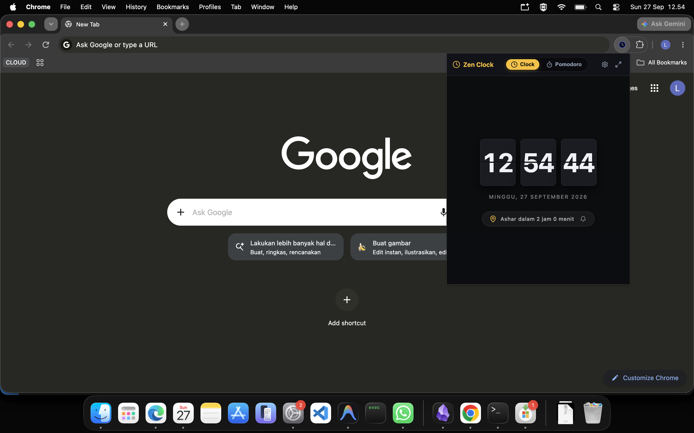

# ⏰ Zen Clock: Pomodoro & Jadwal Sholat (Web & PWA)

<p align="center">
  
</p>

<p align="center">
  <b>Jam mekanik 3D retro flip yang estetik, bebas distraksi, dipadukan dengan siklus fokus Pomodoro dan jadwal sholat astronomis presisi. Central web hub & standalone PWA untuk ekosistem multi-platform Zen Clock.</b>
</p>

<p align="center">
  <a href="./README.md">English</a> | <b>Bahasa Indonesia</b>
</p>

<p align="center">
  
  
  
  
  <a href="https://marketplace.visualstudio.com/items?itemName=lutfialdrii.extension-clock">
    
  </a>
</p>

---

## 🌟 Gambaran Umum

**Zen Clock** dirancang khusus untuk para pengembang perangkat lunak, pekerja profesional, pelajar, dan siapa saja yang ingin menjaga konsentrasi kerja mendalam (*deep work*) sembari tetap tepat waktu menunaikan ibadah sholat fardhu.

Mengusung tema gelap *Obsidian Dark* beraksen *Glassmorphism*, Zen Clock menghadirkan animasi kartu lipat mekanik 3D retro yang menenangkan, timer fokus Pomodoro, dan perhitungan jadwal sholat otomatis berdasarkan standar resmi Kementerian Agama Republik Indonesia (Kemenag RI).

Website ini berfungsi ganda sebagai **Progressive Web App (PWA) mandiri** yang dapat dipasang langsung di layar utama/desktop Anda, sekaligus sebagai **Hub Ekosistem Terpadu** yang menghubungkan ekstensi VS Code, ekstensi Browser, hingga program terminal CLI Zen Clock.

---

## ✨ Fitur-Fitur Unggulan

### 🕰️ 1. Jam Flip Mekanik 3D Retro
- **Animasi Lipatan Kartu 3D Halus:** Transisi kartu mekanik split-flap yang realistis dan memanjakan mata.
- **Layar Hero Penuh (100vh):** Bebas distraksi, tanpa banner mengganggu. Waktu Anda menjadi fokus utama.
- **Tanggal Dinamis:** Menampilkan hari, tanggal, bulan, dan tahun sesuai bahasa pilihan Anda.
- **Mode Layar Penuh (Fullscreen):** 1-klik untuk mengubah monitor kedua, tablet, atau iPad menjadi jam meja retro estetik.

### 🍅 2. Timer Pomodoro Terintegrasi
- **Siklus Klasik 25/5:** 25 menit kerja fokus tanpa henti diselingi 5 menit istirahat pemulihan.
- **State Persisten:** Timer tetap sinkron walau tab diminimize atau halaman direfresh berkat penyimpanan `localStorage`.
- **Indikator Visual Dinamis:** Cincin progress dan titik pendar yang menandakan mode kerja atau istirahat sedang berjalan.

### 🕌 3. Jadwal Sholat Standar Resmi Kemenag RI
- **Perhitungan Astronomi Presisi:** Ditenagai oleh algoritma astronomi [`adhan`](https://github.com/batoulapps/adhan-js).
- **Parameter Resmi Kemenag RI:**
  - Sudut Subuh: **20.0°**, Sudut Isya: **18.0°**
  - Madhab: **Syafi'i**
  - Pembulatan: **Ke Atas (Rounding Up)**
  - Pengaman Ihtiyat: **+2 menit** pada seluruh waktu sholat (Terbit: -2m).
- **Penyesuaian Otomatis Sholat Jum'at:** Label waktu sholat "Dzuhur" otomatis berganti menjadi **"Jum'at"** setiap hari Jumat.
- **Koreksi Menit Sholat (-15m hingga +15m):** Menu kalibrasi waktu sholat untuk menyelaraskan jadwal dengan masjid setempat secara interaktif.
- **Notifikasi Desktop:** Pengingat audio dan dialog desktop saat waktu adzan tiba.

### 📍 4. Database Lokasi & Smart Geolocation
- **514 Kota & Kabupaten di Indonesia:** Lengkap mencakup seluruh 38 provinsi di Indonesia secara luring (*offline*).
- **40+ Kota Internasional:** Koordinat dan zona waktu bawaan untuk kota-kota besar dunia (Mekkah, Madinah, Tokyo, London, dll.).
- **Deteksi GPS 1-Klik:** Deteksi otomatis koordinat dan zona waktu akurat via GPS browser.
- **Pencarian Kota Global:** Cari kota di belahan dunia mana pun via OpenStreetMap Nominatim.

### 🎨 5. 6 Warna Aksen Tema & Kustom HEX
- **6 Pilihan Warna Siap Pakai:** *Warm Amber* (Bawaan), *Islamic Emerald*, *Modern Sky Cyan*, *Pomodoro Rose*, *Mystic Purple*, dan *Monochrome Silver*.
- **Input Kode HEX Bebas:** Masukkan kode warna heksadesimal favorit Anda (misal `#fbbf24`) dengan kalkulasi otomatis kontras teks agar selalu nyaman dibaca.

### 📱 6. Progressive Web App (PWA)
- **Pasang ke Layar Utama:** Dapat diinstal selayaknya aplikasi desktop native di macOS, Windows, Linux, Android, dan iOS.
- **Mendukung Mode Offline:** Service Worker berbasis Workbox memastikan jam tetap berfungsi meski koneksi internet terputus.

---

## 🧭 Arsitektur Halaman Platform (Multi-Page)

Zen Clock menggunakan arsitektur routing sisi klien yang responsif dan tanpa reload halaman:

| Rute URL | Komponen Halaman | Tujuan & Konten |
| :--- | :--- | :--- |
| **`/`** | `DeskClockPage` | Aplikasi jam utama (Jam Flip, Pomodoro, Jadwal Sholat, Fullscreen, Modal Pengaturan). |
| **`/explore`** | `ExplorePage` | Bridging Hub pengantar ekosistem aplikasi Zen Clock dengan kartu navigasi langsung. |
| **`/vscode`** | `ExtensionLanding` | Landing page terfokus untuk ekstensi VS Code (preview frame macOS, perintah salin CLI, galeri antarmuka editor). |
| **`/browser`** | `BrowserLanding` | Landing page terfokus untuk ekstensi Chrome & Edge (preview popup, unduh ZIP, panduan Developer Mode). |

> **Dukungan Static Hosting:** Mendukung penuh HTML5 History API (`pushState`/`popstate`), fallback hash (`/#explore`, `/#vscode`, `/#browser`), serta berkas rewrite bawaan (`_redirects` dan `vercel.json`) agar refresh di rute mana pun tidak menghasilkan error 404.

---

## 🚀 Ekosistem Multi-Platform

Zen Clock terus berkembang di berbagai platform kerja harian Anda:

```
                            ┌────────────────────────┐
                            │ Zen Clock Ecosystem Hub│
                            └───────────┬────────────┘
         ┌───────────────────┬──────────┴───────────┬──────────────────┐
         ▼                   ▼                      ▼                  ▼
┌─────────────────┐ ┌─────────────────┐  ┌────────────────────┐ ┌───────────────────┐
│   Web & PWA     │ │ VS Code Ext     │  │ Browser Extension  │ │ CLI Program (Go)  │
│ (zen-flip-clock)│ │(extension-clock)│  │(extension-browser) │ │  (cli-zen-clock)  │
└─────────────────┘ └─────────────────┘  └────────────────────┘ └───────────────────┘
                                       │
                                       ▼
                        ┌───────────────────────────────┐
                        │    Native & Mobile Roadmap    │
                        │ macOS · Windows · Linux · App │
                        └───────────────────────────────┘
```

1. **[Zen Clock Web (Repositori Ini)](https://github.com/lutfialdrii/zen-flip-clock-web)**: Aplikasi web interaktif & PWA.
2. **[VS Code Extension (`lutfialdrii.extension-clock`)](https://marketplace.visualstudio.com/items?itemName=lutfialdrii.extension-clock)**: Sematkan jam di Sidebar, Panel Terminal, atau Status Bar editor.
3. **[Browser Extension (`extension-browser-zen-clock`)](https://github.com/lutfialdrii/zen-clock-extension-browser)**: Quick popup di toolbar dan tab baru jam meja untuk Chrome & Edge.
4. **CLI Program (`cli-zen-clock`)**: Jam flip ASCII dan daemon jadwal sholat ultra-ringan berbasis Go di terminal.
5. **Aplikasi Native (Roadmap)**: Aplikasi desktop/mobile native berbasis Flutter untuk macOS menu bar, Windows tray, dan Linux.

---

## 🌐 Dukungan Dua Bahasa (i18n)

Zen Clock mendukung pergantian bahasa instan:
- **Bahasa Indonesia (`id`)**
- **English (`en`)**

Preferensi bahasa otomatis terdeteksi saat pertama kali dibuka dan tersimpan di `localStorage`.

---

## 🚢 Panduan Deployment ke Hosting

Repositori ini telah dikonfigurasi siap pakai untuk berbagai platform hosting statis populer tanpa perlu konfigurasi rumit tambahan.

### 1. Cloudflare Pages (Direkomendasikan)
1. Hubungkan repositori GitHub Anda ke **Cloudflare Pages**.
2. Pilih **Framework Preset**: `Vite`.
3. Isi **Build command**: `npm run build`.
4. Isi **Build output directory**: `dist`.
5. *Catatan: Rute SPA ditangani otomatis oleh berkas [`public/_redirects`](./public/_redirects).*

### 2. Vercel
1. Import repositori GitHub Anda ke **Vercel**.
2. Framework preset akan otomatis mendeteksi `Vite`.
3. Klik **Deploy**!
4. *Catatan: Penanganan rewrite rute SPA ditangani otomatis oleh [`vercel.json`](./vercel.json).*

### 3. Netlify
1. Hubungkan repositori ke **Netlify**.
2. Build command: `npm run build`
3. Publish directory: `dist`
4. *Catatan: Aturan pengalihan rute ditangani otomatis oleh berkas `_redirects`.*

### 4. GitHub Pages
Jika di-deploy ke GitHub Pages dengan subpath (misal: `username.github.io/repo-name`):
1. Sesuaikan opsi `base: '/repo-name/'` pada `vite.config.js`.
2. Gunakan GitHub Actions dengan template `peaceiris/actions-gh-pages`.

---

## 💻 Panduan Pengembangan Lokal

### Prasyarat
- [Node.js](https://nodejs.org/) v18.0 atau lebih baru
- `npm` v9.0 atau lebih baru

### Langkah Menjalankan

```bash
# 1. Clone repositori
git clone https://github.com/lutfialdrii/zen-flip-clock-web.git
cd zen-flip-clock-web

# 2. Pasang dependensi
npm install

# 3. Jalankan server lokal (dengan HMR)
npm run dev

# 4. Buka di peramban
# URL: http://localhost:5173
```

### Perintah Berguna

```bash
npm run dev        # Menjalankan server development Vite
npm run build      # Mengompilasi berkas produksi ke folder dist/
npm run preview    # Menjalankan pratinjau lokal dari hasil build dist/
npm run lint       # Menjalankan pengecekan gaya kode ESLint
```

---

## 📁 Struktur Direktori Proyek

```text
zen-flip-clock/
├── public/
│   ├── _redirects              # Aturan penulisan ulang rute SPA untuk Cloudflare Pages & Netlify
│   ├── assets/                 # Tangkapan layar dan gambar pratinjau resolusi tinggi
│   ├── favicon.svg             # Ikon aplikasi vektor
│   └── manifest.webmanifest    # Spesifikasi PWA web manifest
├── src/
│   ├── components/
│   │   ├── browser/            # Halaman khusus Browser Extension
│   │   ├── explore/            # Bridging Hub penjelajahan ekosistem
│   │   ├── AdjustModal.jsx     # Modal koreksi menit sholat
│   │   ├── CityPickerModal.jsx # Pemilih kota luring & deteksi GPS
│   │   ├── ExtensionLanding.jsx# Halaman khusus ekstensi VS Code
│   │   ├── FlipClock.jsx       # Mesin jam mekanik 3D retro
│   │   ├── PomodoroTimer.jsx   # Timer Pomodoro kerja & istirahat
│   │   ├── PrayerTime.jsx      # Jadwal sholat harian & hitung mundur
│   │   └── SettingsModal.jsx   # Pengaturan tema, bahasa, dan kota
│   ├── utils/
│   │   ├── citiesData.js       # Database 514 kota Indonesia + 40 kota dunia
│   │   ├── i18n.jsx            # Provider React LanguageContext
│   │   ├── prayerHelper.js     # Formula astronomi resmi Kemenag RI
│   │   ├── storage.js          # Lapisan penyimpanan lokal persisten
│   │   └── translations.js     # Kamus multibahasa (ID & EN)
│   ├── App.jsx                 # Root aplikasi & sinkronisasi router SPA
│   └── main.jsx                # Entrypoint React DOM dengan registrasi PWA
├── vercel.json                 # Konfigurasi rewrite SPA untuk hosting Vercel
├── vite.config.js              # Konfigurasi bundler Vite & plugin PWA
└── package.json                # Dependensi proyek dan skrip npm
```

---

## 💖 Dukung Pengembang

Zen Clock 100% gratis, open-source, dan bebas dari segala bentuk iklan. Jika aplikasi ini membantu Anda menjaga ketenangan, ketepatan waktu ibadah, dan produktivitas harian, dukung pengembangannya:

- ☕ **Saweria:** [saweria.co/lutfialdrii](https://saweria.co/lutfialdrii) (GoPay, OVO, Dana, QRIS)
- ⭐ **Beri Bintang di GitHub:** Berikan bintang pada repositori ini agar semakin bermanfaat bagi lebih banyak orang!

---

## 📄 Lisensi

Proyek ini dilisensikan di bawah [Lisensi MIT](./LICENSE) — bebas digunakan untuk keperluan pribadi maupun komersial.

---

Dibuat dengan sepenuh hati oleh [lutfialdrii](https://github.com/lutfialdrii).
