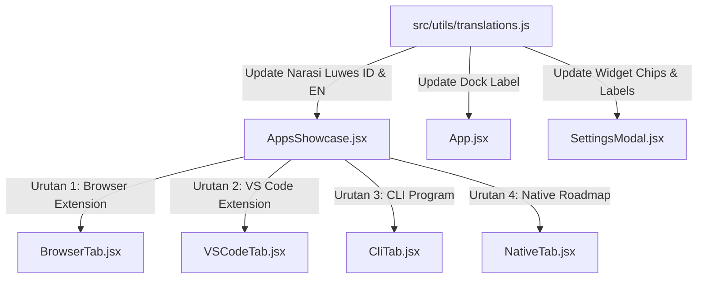

# Rencana Implementasi: Reordering Produk (#1 Browser Extension), Naming "Zen Clock Apps", & Refinement Narasi Santai & Luwes

Dokumen rencana teknis ini menyusun perombakan gaya bahasa (*tone of voice*) agar **Bahasa Indonesia terasa luwes, natural, ramah, dan tidak kaku** bagi target pasar Indonesia, sembari menerapkan **Browser Extension sebagai produk nomor satu (#1)** dan standarisasi penamaan **"Zen Clock Apps"**.

---

## 1. Goal Description

### Latar Belakang & Masalah
1. **Tata Bahasa Indonesia Terlalu Kaku**: Deskripsi sebelumnya terkesan kaku seperti terjemahan dokumen formal/mesin (misal: *"peramban"*, *"menampilkan hitung mundur waktu sholat otomatis"*, *"tidak meninggalkan editor kode"*). Perlu dirombak agar lebih luwes, enak dibaca, dan relevan dengan gaya komunikasi pengguna internet dan developer Indonesia masa kini.
2. **Urutan Produk (Product Hierarchy)**: Browser Extension diposisikan sebagai produk unggulan pertama (#1) yang langsung dilihat saat `/apps` dibuka, disusul oleh VS Code Extension (#2), CLI Program (#3), dan Native Roadmap (#4).
3. **Standarisasi Penamaan**: Menghilangkan kata *"Ekosistem"* dan menggunakan istilah **"Zen Clock Apps"**.
4. **Hero Tagline**: Sesuai arahan: **"Alat Fokus & Pengingat Waktu untuk Muslim"**.

---

## 2. User Review Required

> [!IMPORTANT]
> **Perbandingan Narasi: Dari Kaku/Formal ➔ Menjadi Luwes, Santai & Ramah Pengguna**:

### Matriks Narasi Baru (Bahasa Indonesia Luwes & English)

| Elemen UI | Narasi Lama (Kaku/Formal) | Usulan Narasi Baru (Luwes & Bersahabat) 🇮🇩 | English Version 🇬🇧 |
| :--- | :--- | :--- | :--- |
| **Hero Tag** | *Ekosistem Produktivitas & Ibadah* | **Alat Fokus & Pengingat Waktu untuk Muslim** | **Focus & Prayer Reminder for Muslims** |
| **Hero Title** | *Zen Clock Ecosystem* | **Zen Clock Apps** | **Zen Clock Apps** |
| **Hero Subtitle** | *Satu filosofi ketenangan, hadir di mana pun Anda berkarya...* | **Fokus dan Tetap Ingat Waktu sebagai Muslim.** | **Focus and Always Remember Time as a Muslim.** |
| **Nav Brand Title** | *Ekosistem Zen Clock* | **Zen Clock Apps** | **Zen Clock Apps** |
| **Dock Button (Web Clock)** | *✦ Jelajahi Ekosistem Zen Clock (VS Code · Browser · CLI) →* | **✦ Explore Zen Clock Apps (Browser Extension, VS Code Extension & CLI) →** | **✦ Explore Zen Clock Apps (Browser Extension, VS Code Extension & CLI) →** |
| **Below-Fold Caption** | *Ekosistem Zen Clock* | **Zen Clock Apps** | **Zen Clock Apps** |
| **Widget Label (Settings)** | *Ekosistem Zen Clock* | **Zen Clock Apps** | **Zen Clock Apps** |
| **Widget Desc (Settings)** | *Tersedia untuk Browser Extension, VS Code Extension, dan CLI (Go).* | **Explore Zen Clock Apps (Browser Extension, VS Code Extension & CLI)** | **Explore Zen Clock Apps (Browser Extension, VS Code Extension & CLI)** |
| **Widget Chips (Settings)** | *VS Code · Browser · CLI · Native* | **Browser Extension · VS Code Extension · CLI · Native** | **Browser Extension · VS Code · CLI · Native** |
| **Browser Tab Headline** | *Waktu Sholat & Flip Clock di Setiap Tab Browser Anda* | **Flip Clock, Jadwal Reminder Sholat serta Pomodoro di Browser Extension** | **Flip Clock, Prayer Schedule & Pomodoro Timer on Browser Extension** |
| **Browser Tab Description** | *Ekstensi peramban modern untuk Google Chrome... Hadir sebagai popup cepat maupun tampilan new tab...* | **Zen Clock langsung dari toolbar. Praktis, ringan, dan tetap ingat waktu sebagai Muslim.** | **Zen Clock on your toolbar with Prayer Schedule and Pomodoro. Fast, lightweight, and easy to use.** |
| **VS Code Tab Headline** | *Ketenangan & Pengingat Sholat di Editor Kode Anda* | **Zen Clock, Jadwal Sholat serta Pomodoro di VS Code** | **Zen Clock, Prayer Reminder & Pomodoro in VS Code** |
| **VS Code Tab Description** | *Tetap khusyuk berkarya tanpa melupakan waktu ibadah. Zen Clock hadir langsung di status bar...* | **Fokus dan Tetap Ingat Waktu sebagai Muslim walau keasikan ngoding.** | **Focus and Always Remember Time as a Muslim while enjoying coding.** |
| **CLI Tab Headline** | *Jam Mekanik & Jadwal Sholat di Terminal Anda* | **Zen Clock, Jadwal Sholat serta Pomodoro di Terminal Favoritmu** | **Flip Clock, Prayer Schedule & Pomodoro Timer on Terminal** |
| **CLI Tab Description** | *Aplikasi CLI ultra-ringan berbasis bahasa Go (<10MB RAM). Menampilkan jam flip ASCII interaktif...* | **Buat kamu yang sering kerja di terminal.** | **Built for terminal muslim users.** |
| **Native Tab Headline** | *Rencana Aplikasi Native untuk Desktop & Mobile* | **Rencana Aplikasi Desktop & Mobile** | **Desktop & Mobile Apps Roadmap** |
| **Native Tab Description** | *Zen Clock dirancang untuk hadir di seluruh sistem operasi desktop dan mobile di masa depan.* | **Zen Clock rencananya bakal hadir langsung di Menu Bar macOS, Windows Tray, Linux, dan aplikasi mobile (Android & iOS).** | **Zen Clock is planned to run natively on macOS Menu Bar, Windows Tray, Linux, and mobile apps (iOS & Android).** |

---

## 3. Open Questions

Tidak ada pertanyaan pemblokir. Pendekatan bahasa di atas dirancang ramah, komunikatif, dan alami bagi orang Indonesia tanpa menghilangkan esensi fungsional setiap produk.

---

## 4. Proposed Changes



### Component: Localization (`src/utils/`)

#### [MODIFY] `src/utils/translations.js`
- Ganti seluruh teks kamus `id` dengan gaya bahasa yang luwes, bersahabat, dan tidak kaku sesuai tabel di Bagian 2.
- Ganti padanan bahasa Inggris (`en`) yang selaras dan kasual profesional.
- Perbarui urutan teks tombol dock `exploreEcosystem`.

---

### Component: Showcase Hub (`src/components/showcase/`)

#### [MODIFY] `src/components/showcase/AppsShowcase.jsx`
- Ubah `VALID_TABS` array: `['browser', 'vscode', 'cli', 'native']`.
- Jadikan `'browser'` sebagai `initialTab` default.
- Posisikan tab `Browser Extension` di urutan pertama pada bar tab segmented.
- Posisikan tab `Browser Extension` di urutan pertama pada panel render konten.

---

### Component: Live Web Clock App Shell & Settings (`src/`)

#### [MODIFY] `src/App.jsx`
- Ubah default klik dock explore: `navigateTo('apps', 'browser')`.
- Teruskan handler ke settings: `onOpenEcosystem={(tab) => { setIsSettingsOpen(false); navigateTo('apps', tab || 'browser'); }}`.

#### [MODIFY] `src/components/SettingsModal.jsx`
- Ubah teks sub-chip widget CTA menjadi `"Browser Extension · VS Code · CLI · Native"`.
- Hubungkan klik default agar membuka tab `'browser'`.

---

### Component: Documentation

#### [MODIFY] `CHANGELOG.md`
- Catat pembaruan reordering produk (Browser Extension #1), penyempurnaan gaya bahasa Bahasa Indonesia yang santai dan luwes, serta standarisasi nama *Zen Clock Apps*.

---

## 5. Verification Plan

### Automated Tests
1. **ESLint**:
   ```bash
   npm run lint
   ```
   *Ekspektasi: 0 error, 0 warning.*

2. **Production Build**:
   ```bash
   npm run build
   ```
   *Ekspektasi: Vite build sukses (exit code 0) dan service worker PWA ter-generate.*

3. **Node Module Verification**:
   ```bash
   node -e "
   import('./src/utils/translations.js').then(({ translations }) => {
     console.log('ID Tag:', translations.id.hero.tag);
     console.log('ID Subtitle:', translations.id.hero.subtitle);
     console.log('ID Browser Desc:', translations.id.browser.description);
     console.log('ID VSCode Desc:', translations.id.vscode.description);
     if (translations.id.hero.subtitle.includes('filosofi')) {
       throw new Error('Still contains stiff text');
     }
   });
   "
   ```

### Manual Verification
1. Jalankan `npm run dev` dan buka `http://localhost:5173/`.
2. Scroll ke bawah, periksa teks tombol: `✦ Coba Zen Clock di Browser Extension, VS Code & CLI →`.
3. Buka halaman `/apps`:
   - Pastikan tab pertama yang aktif adalah **Browser Extension**.
   - Periksa urutan tab: `Browser Extension` ➔ `VS Code Extension` ➔ `CLI Program (Go)` ➔ `Native & Mobile Roadmap`.
   - Baca deskripsi pada tab Browser Extension, VS Code, dan CLI: pastikan terdengar santai, enak dibaca, dan tidak kaku.
4. Buka modal Settings di live clock, periksa widget "Zen Clock Apps" dengan teks deskripsi yang santai, lalu klik untuk memastikan langsung berpindah ke tab Browser Extension.
